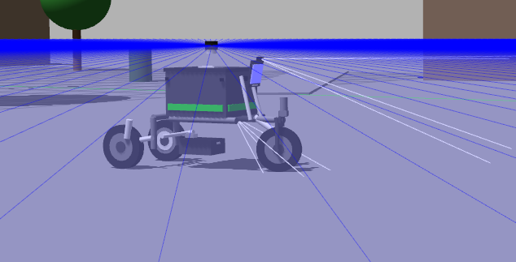

# BGLX — Autonomous Last-Mile Delivery E-Trike

**A delivery tricycle you operate in plain language.** Tell it what to do; it
plans, drives, and — when it fails — explains why in terms a person or an
agent can act on.

An autonomy stack for a steered electric cargo trike, developed in simulation
and on hardware in parallel. The target is campus and institutional
logistics: contained, low-speed, geofenced environments where last-mile
autonomy is tractable today rather than aspirational.



```
task> patrol between the loading dock and the north entrance until I stop you

[agent] Checking where I am before planning a route.
[tool ] get_pose()
[obs ]  Position (2.86, 0.01) in map, heading 0.3 deg. Inside the mapped area.
[tool ] navigate_to_landmark({'name': 'loading_dock'})
[obs ]  Arrived at (7.40, 1.22), 0.19m from the goal, in 11.3s.
```

## What's different

Two things, and the second matters more.

**Natural-language operation.** Most delivery robots are commanded in
coordinates or fixed waypoint lists, which means every new task is a
configuration job for an engineer. BGLX takes the task in language and works
out the goals itself. Operators describe outcomes, not coordinates.

**Machine-legible failure.** This is the harder problem and the real moat.
Nav2 reports `ABORTED` — a status code no agent can act on. A robot that
fails opaquely needs a human to interpret it, which destroys the economics of
an autonomous fleet. BGLX translates robot state into diagnosis:

> *"Aborted 2.3 m from the goal. A path existed but the robot did not move
> for 6.4 s — the local planner found no feasible trajectory. Given the
> 1.94 m turning circle this usually means the approach angle is too tight.
> Back off and re-approach from further out."*

That paragraph is the difference between a robot that gets stuck and a robot
that gets itself unstuck. It accumulates: every field failure understood
becomes a diagnosis the fleet never needs a human for again.

**Inference runs locally.** A campus vehicle cannot depend on reaching a
cloud endpoint. The agent runs on a local model on the vehicle's own compute,
with cloud backends available but not required.

## Why a tricycle

Most open autonomy stacks assume a differential-drive robot that can rotate
in place. A cargo trike cannot. With a 1.33 m wheelbase and a 0.6 rad
steering limit, the minimum turning radius is **1.94 m**, and yaw rate is
proportional to forward speed — at standstill, steering does nothing.

That single constraint propagates through the entire stack: the global
planner must produce kinematically feasible paths, the local controller must
never command in-place rotation, Nav2's default `spin` recovery is useless,
and goal tolerances have to accept approximate final headings. Most of the
engineering here follows from taking that seriously.

## Status

| Capability | Simulation | Hardware |
|---|---|---|
| Steered-tricycle kinematics (`ros2_control`) | Working | Controller written, untested on vehicle |
| SLAM (`slam_toolbox`) | Working | First map captured |
| Nav2 navigation, Hybrid-A\* + RPP | Working | Not yet |
| 2D LiDAR + depth voxel costmaps | Working | LiDAR driver containerised |
| IMU odometry (MPU6050) | — | Publishing to `/imu` |
| Frontier exploration | Working | Not yet |
| Natural-language task control | Working | Not yet |
| Reverse manoeuvres | Disabled — no rear sensing | Not yet |

## Stack

**Planning.** Nav2 `SmacPlannerHybrid` with `minimum_turning_radius: 2.0` and
Dubins motion, so global paths are drivable by the actual vehicle rather than
by a holonomic idealisation. Regulated Pure Pursuit for local control with
`use_rotate_to_heading: false`, and velocity scaling through tight curvature.

**Sensing.** A 360° LiDAR feeds the costmap obstacle layer; a forward depth
camera feeds a voxel layer, so obstacles below or above the 2D scan plane are
still avoided. A `cmd_vel_limiter` node bridges Nav2's Twist output to the
tricycle steering controller, enforcing a speed-dependent steering limit
derived from a lateral acceleration bound.

**Exploration.** A frontier explorer scores candidates by information gained
per unit of *real* travel — `info_gain / (1 + A*_path_cost)` — so it sweeps
continuously instead of ping-ponging across the map. It only selects goals;
Nav2 does the planning and driving.

**The agentic layer.** `bglx_agentic` exposes eight tools over Nav2, TF and
the LiDAR, and turns robot state into text a model can reason about.

- 720 LiDAR rays collapse to eight named sectors, with a 3-ray erosion so a
  single spurious return cannot report a whole sector as blocked.
- Turn-in-place commands are rejected with an explanation, because a language
  model's prior is overwhelmingly differential-drive and the failure would
  otherwise be silent.
- Outside the costmap no goal can be planned, so the tool layer refuses to
  try and says why, rather than letting the planner fail opaquely.

Backends: local (`ollama`), any OpenAI-compatible endpoint, or Anthropic.
Only one file knows which.

## Packages

| Package | Role |
|---|---|
| `etrike_description` | URDF (modular xacro), Gazebo worlds, sensor models, `ros2_control` tricycle interface, RViz views |
| `bglx_navigation` | Nav2 bringup and params, `cmd_vel_limiter` steering bridge |
| `bglx_autonomy` | Waypoint follower with LiDAR front-cone obstacle stop |
| `bglx_exploration` | Info-gain / path-cost frontier explorer |
| `bglx_agentic` | Sensor and failure translation, LLM tool layer and agent loop |

## Run it

ROS 2 Humble, Gazebo Classic, plus `navigation2`, `nav2-bringup`,
`slam-toolbox`, `ros2-controllers`, `gazebo-ros2-control`, `topic-tools`.

```bash
cd bglx_ws
colcon build --symlink-install
source install/setup.bash
```

One terminal each, all sourced, in order:

```bash
# 1. Simulation, controllers, odom TF relay
ros2 launch etrike_description gazebo.launch.py

# 2. SLAM (map -> odom)
ros2 launch etrike_description slam.launch.py

# 3. Nav2
ros2 launch bglx_navigation navigation.launch.py

# 4a. Autonomous frontier exploration
ros2 launch bglx_exploration explore.launch.py

# 4b. ...or natural-language control
ollama pull qwen2.5:7b
ros2 run bglx_agentic agent

# 4c. ...or a manual goal from RViz with the Nav2 Goal tool
```

## Known limitations

Stated explicitly, because they matter more than the feature list.

- **Reverse is disabled.** The planner is Dubins forward-only and the
  controller has `allow_reversing: false`, so the trike can get into
  positions it cannot leave. Enabling Reeds-Shepp requires rear sensing in
  the costmap first — backing a loaded vehicle blind is not acceptable on a
  campus.
- **The sim LiDAR minimum range is masked to 0.45 m** to reject beams
  clipping the trike's own frame. That is a workaround; the correct fix is
  relocating the sensor, and the same self-occlusion needs checking on the
  physical mount.
- **`track_unknown_space` is disabled** on the global costmap so the planner
  will route through unexplored ground. Acceptable in simulation, not on a
  real campus.
- **Failure diagnoses are validated in simulation only.** Signals like
  "stalled for N seconds" are clean in Gazebo and will be considerably
  noisier with real wheel slip and outdoor LiDAR dropout.

## Roadmap

- Hardware bring-up: throttle-by-wire, the `ros2_control` tricycle controller
  on the physical vehicle, IMU/GPS odometry fusion.
- Rear sensing, then Reeds-Shepp planning for reverse manoeuvres.
- Validating the failure-translation layer against real-world noise.
- Measuring how far local inference gets before cloud models are needed.
- Exploration tuning against real coverage metrics.
