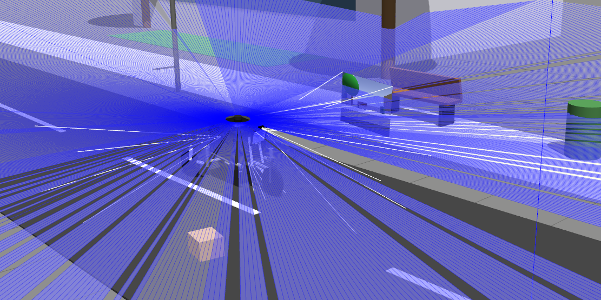

# BGLX — Autonomous Last-Mile Delivery E-Trike (Simulation)

A ROS 2 / Gazebo simulation of an autonomous last-mile delivery tricycle.
Built to prototype the perception, planning, and control primitives for
campus-based delivery — a contained, low-speed environment (students as
early users) chosen as a realistic first wedge for last-mile autonomy.



## Current status

Working in simulation:
- **Vehicle model** — full URDF of the e-trike, built from modular xacro
  components (frame, front fork, rear drive, battery, cargo box, control
  panel, sensor mounts).
- **Environments** — two Gazebo worlds (`campus.world`, `delivery_campus.world`)
  with buildings, roads, crosswalks, trees, and pedestrians.
- **Sensing** — LiDAR sensor model publishing scans (shown above).
- **Planning** — A* global path planning.
- **SLAM** — slam_toolbox integration for mapping/localization.
- **Visualization** — RViz configs for the robot, sim, and SLAM views.

Not yet built:
- Hardware / physical trike.
- On-vehicle deployment of the planning + perception stack.

This is a learning and prototyping project — I built it to work through the
robotics primitives (URDF modeling, SLAM, planning, sensor simulation)
hands-on, the same way I taught myself computer-vision engineering.

## Package: `etrike_description`

| Path | Contents |
|------|----------|
| `urdf/` | E-trike model — `etrike.urdf.xacro` + modular components & macros |
| `worlds/` | Gazebo worlds — `campus.world`, `delivery_campus.world` |
| `launch/` | Bringup — Gazebo, SLAM, display, campus sim |
| `config/` | `slam_toolbox.yaml` |
| `rviz/` | RViz configs (robot / sim / SLAM) |

## Run it

Requires ROS 2 Humble + Gazebo.

```bash
cd bglx_ws
colcon build --symlink-install
source install/setup.bash

# Campus world with the trike
ros2 launch etrike_description gazebo_campus.launch.py

# SLAM in simulation
ros2 launch etrike_description slam_simulation.launch.py

# View the model in RViz
ros2 launch etrike_description display.launch.py
```

## Roadmap

- Close the loop: A* planning driving the trike through the campus world.
- Move from simulation toward a hardware prototype.
