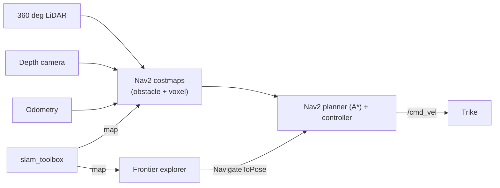

# BGLX — Autonomous Last-Mile Delivery E-Trike (Simulation)

A ROS 2 / Gazebo simulation of an autonomous last-mile delivery tricycle.
Built to prototype the perception, planning, and control stack for
campus-based delivery — a contained, low-speed environment chosen as a
realistic first wedge for last-mile autonomy.


## What it does

The trike drives itself in simulation — sense, map, plan, avoid, and explore:

- **Autonomous motion** — a waypoint follower closes the `cmd_vel` loop:
  creep to a goal, steer, and hard-stop on a lidar obstacle.
- **Nav2 navigation** — full Nav2 stack (planner + controller + costmaps +
  behavior tree) drives the trike to goals and **plans around obstacles**.
- **2D + 3D obstacle sensing** — a 360 deg lidar feeds the costmap, and a
  forward depth camera feeds a **voxel layer** so low/near obstacles the 2D
  lidar plane misses are still avoided.
- **SLAM** — `slam_toolbox` builds and localizes against the map online.
- **A\* planning** — Nav2 global planner runs A* for efficient single-goal
  driving plans.
- **Autonomous exploration** — a frontier explorer maps the whole space on
  its own, scoring frontiers by **information gained per unit of real travel**
  (`info_gain / (1 + A*_path_cost)`), so it sweeps continuously instead of
  ping-ponging across the map.

## Packages

| Package | Role |
|---|---|
| `etrike_description` | E-trike URDF (modular xacro), Gazebo worlds, sensor models, SLAM config, RViz views |
| `bglx_autonomy` | Waypoint follower — `cmd_vel` loop with a lidar front-cone obstacle stop |
| `bglx_navigation` | Nav2 bringup + params (lidar obstacle layer + depth voxel layer, A* planner, tuned for the trike footprint) |
| `bglx_exploration` | Info-gain / A*-path-cost frontier explorer feeding `NavigateToPose` goals to Nav2 |

## Run it

Requires **ROS 2 Humble** + **Gazebo Classic**, plus `navigation2`,
`nav2-bringup`, and `slam-toolbox`.

```bash
cd bglx_ws
colcon build --symlink-install
source install/setup.bash
```

Bring the stack up in order (one terminal each, all sourced):

```bash
# 1. Simulation
ros2 launch etrike_description gazebo.launch.py

# 2. SLAM (map -> odom)
ros2 run slam_toolbox async_slam_toolbox_node --ros-args \
  --params-file install/etrike_description/share/etrike_description/config/slam_toolbox.yaml \
  -p use_sim_time:=true

# 3. Nav2
ros2 launch bglx_navigation navigation.launch.py

# 4a. Autonomous frontier exploration (maps the world by itself)
ros2 launch bglx_exploration explore.launch.py

# 4b. ...or simple waypoint following
ros2 launch bglx_autonomy waypoint_follower.launch.py
```

Send a manual goal from RViz with the **Nav2 Goal** tool, or let the explorer
pick its own.

## How it works



The frontier explorer only *selects* goals; Nav2 does the actual planning,
obstacle avoidance, and driving.

## Roadmap

- **Hybrid-A\*** global planner for the real *steered* tricycle (respects a
  turning radius — it can't rotate in place like the sim's diff-drive).
- **Hardware bring-up** — throttle-by-wire, real YDLIDAR + depth, IMU/GPS
  odometry, and a `ros2_control` tricycle controller for sim<->real parity.
- Exploration tuning against real coverage metrics.

## Notes

This is a hands-on prototyping project for working through the robotics
primitives — URDF modeling, SLAM, Nav2, sensor simulation, and autonomous
exploration — end to end.
